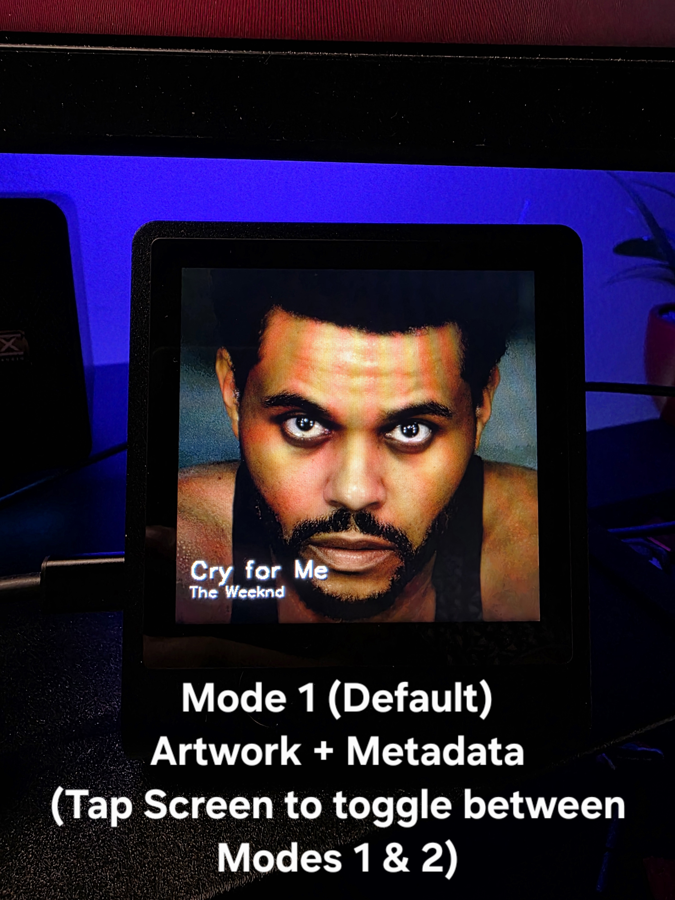
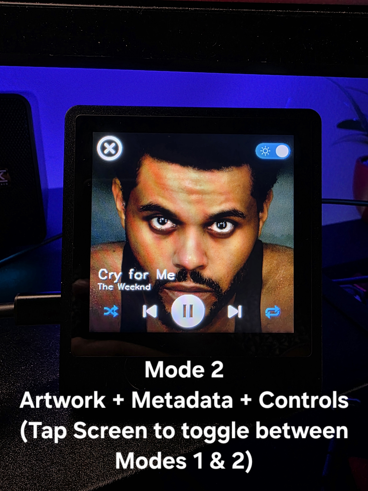
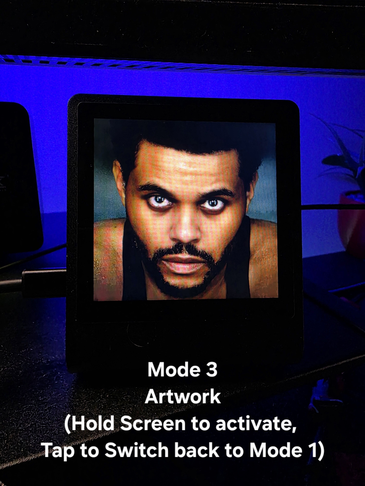
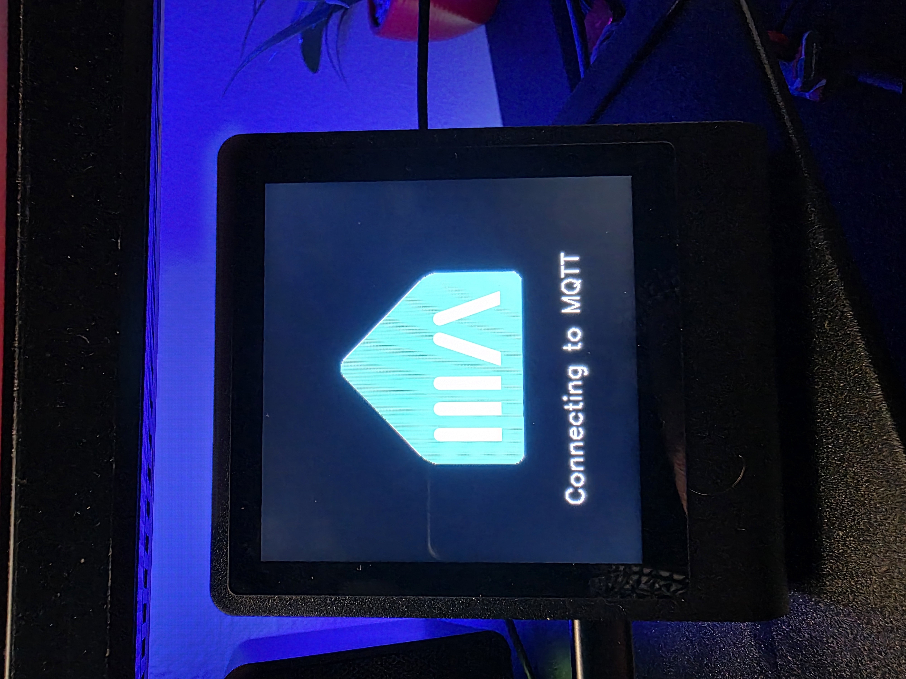

# PrestoDeck for Music Assistant


PrestoDeck is a music controller app for the Pimoroni Presto. It displays the album cover art, name, and artist of the currently playing track and provides basic controls for playback.

PrestoDeck for Music Assistant is a fork of the original PrestoDeck project. This is my first GitHub project and fork, so any suggestions, feedback, or contributions are greatly appreciated.

The original project connected directly to Spotify through the Spotify Web API to display album artwork, track information, and playback controls. Due to recent Spotify API restrictions, that integration may no longer be a viable option for some users. This fork transforms PrestoDeck into a universal Music Assistant controller powered by Home Assistant and MQTT. Instead of being limited to Spotify, it can now control any music source connected to Music Assistant, including Spotify, Plex, TIDAL, Apple Music, local libraries, and more. The original creator also noted occasional touchscreen responsiveness issues caused by the large number of Spotify API requests required to keep playback information synchronized. By replacing the direct Spotify integration with lightweight MQTT updates from Home Assistant and Music Assistant, the interface feels significantly smoother and more responsive while reducing the amount of network traffic and processing required on the device.

This fork also adds native Home Assistant integration, allowing PrestoDeck to function as a controllable smart device within your Home Assistant ecosystem. You can turn the display and back LEDs on or off, adjust screen brightness, and create automations that respond to your smart home. For example, you can automatically power the display on when music starts playing but only if your office monitor is on, dim it a bit when your room gets dark, or turn it off when music is playing but no one is present in the room.

## Features

- Album artwork display
- Track title and artist information
  - Scrolling text for long track titles
  - Unicode support for accented non-English characters (á, é, í, ó, ú, ñ, ü)
- Play/Pause control
- Previous/Next track control
- Shuffle control
- Repeat control
- Display power control
  - Auto wake when playback starts
  - Auto sleep after 5 minutes of inactivity
  - Manual display on/off control with tap-to-wake support 
- Home Assistant MQTT Discovery and Integration
  - Remote display control
  - Remote LED control
  - Remote brightness control
  - Compatible with Home Assistant automations and scenes
- Automatic MQTT reconnection and recovery after connection loss
- Multiple display modes
  - Mode 1 (Default): Displays album artwork with track title and artist at the bottom of the screen. Tap screen to toggle between Mode 1 and Mode 2.
  - Mode 2: Displays playback controls, track title, and artist information. Tap screen to toggle between Mode 2 and Mode 1.
  - Mode 3: Displays only album artwork for a clean now-playing experience. Long press to Enter Mode 3, tap to return to Mode 1.

<p align="center">
  
  
  
  
</p>

<p align="center">
  <strong>🎥 <a href="https://1drv.ms/v/c/4a7516bd91a697de/IQAJGoF-6F_3TJffCg0RI-RWAXN46W10rvfTC2IUkFn4tVs?e=HPrmrF">Watch PrestoDeck for Music Assistant in Action</a></strong>
</p>

## What's Changed in This Fork?

- Replaced Spotify Web API integration with Music Assistant
- Updated branding and UI colors to match Music Assistant
- Updated the existing display modes
  - Mode 1: Album artwork with track title and artist information displayed at the bottom of the screen, eliminating the unused space that previously appeared beneath the text
  - Mode 2: Playback controls with track title and artist information repositioned above the controls for improved visibility (as originally designed)
  - Mode 3: Album artwork only
  - Mode 1 is now the default startup view instead of Mode 3
- Added scrolling text for long track titles
- Added improved Unicode character support for accented non-English characters (á, é, í, ó, ú, ñ, ü)
- Added automatic sleep mode after 5 minutes of inactivity
- Added automatic wake when music playback starts
- Added manual display power controls
  - In Mode 2, tap the X button to turn the display off
  - When the display is off, tap anywhere on the screen to wake it
- Added Home Assistant MQTT Discovery
- Added Home Assistant Integration for display, LEDs, and brightness control
- Added automatic MQTT reconnection and recovery
- Improved overall performance and touchscreen responsiveness by replacing Spotify API polling with MQTT-based communication


## Prerequisites

Before installing PrestoDeck for Music Assistant, ensure the following services are already configured and working:

- Home Assistant: This fork relies on Home Assistant to bridge communication between Music Assistant and the Presto device. Home Assistant is responsible for publishing playback metadata and processing playback control commands.
- MQTT Broker: An MQTT broker such as Mosquitto must be installed and accessible from both Home Assistant and the Presto. MQTT is used for all communication between the device and Home Assistant.
- Music Assistant: Music Assistant must be installed and configured within Home Assistant. Any music provider supported by Music Assistant can be used, including:
  - Spotify
  - Plex
  - Apple Music
  - TIDAL
  - Qobuz
  - Local Music Libraries
  - Internet Radio
  - And many others
- Music Assistant player selection (**Important**)
  - The media player controlled by PrestoDeck must be a Music Assistant player that has been exposed to Home Assistant as a media player entity.
    - **Tip**: Music Assistant allows you to create Player Groups that combine multiple devices into a single player. You can expose a Player Group to Home Assistant and use it with PrestoDeck to control multiple devices simultaneously.
  - When creating automations, always use the media player entity provided by the Music Assistant integration. In some cases, Home Assistant may show two entities for the same device (for example, `media_player.office_soundbar` and `media_player.office_soundbar_2`). Be sure to select the entity created by Music Assistant.
  - Verify that the player appears and functions correctly in both Music Assistant and Home Assistant before proceeding with the PrestoDeck setup.

## Hardware

- [Pimoroni Presto](https://collabs.shop/xbvgb2)
- (Optional) [Right Angle USB C Cable](https://amzn.to/4jUYJ9F)

## Installation 

Follow these steps to install and set up the project on your Presto. You can also follow the [original demo/tutorial video](https://youtu.be/iOz5XUVkFkY), but be sure to skip any steps related to Spotify integration, Spotify authentication, or Spotify API key generation, as this fork uses Music Assistant, Home Assistant, and MQTT instead. 

**Tip:** Don't let the number of steps discourage you—if you've already completed the prerequisites, the entire setup should take about 10-20 minutes depending on your tech-savviness. Most of the work consists of creating two Home Assistant automations and copying a few files to your Presto.

### 1. Create Two Automations in Home Assistant
Before proceeding, make sure you have reviewed the **Music Assistant Player Selection** section in the prerequisites. Once you have selected and verified the Music Assistant media player you want PrestoDeck to control, you can continue with the creation of the required Home Assistant automations.

#### Automation 1 - Publish Music Assistant State
Copy and paste the following automation into Home Assistant and replace `YOURMEDIAPLAYER` with your media player entity from Music Assistant:
```yaml
alias: Presto Deck - Publish Music Assistant State
description: Send now-playing data to Presto Deck over MQTT
triggers:
  - trigger: state
    entity_id: media_player.YOURMEDIAPLAYER
conditions: []
actions:
  - delay:
      hours: 0
      minutes: 0
      seconds: 0
      milliseconds: 750
  - action: mqtt.publish
    data:
      topic: prestodeck/state
      retain: true
      payload: |
        {{
          {
            "id": states('media_player.YOURMEDIAPLAYER') ~ "-" ~
                  (state_attr('media_player.YOURMEDIAPLAYER', 'media_title') or "") ~ "-" ~
                  (state_attr('media_player.YOURMEDIAPLAYER', 'media_artist') or ""),
            "title": state_attr('media_player.YOURMEDIAPLAYER', 'media_title') or "Unknown Track",
            "artist": state_attr('media_player.YOURMEDIAPLAYER', 'media_artist') or "Unknown Artist",
            "album": state_attr('media_player.YOURMEDIAPLAYER', 'media_album_name') or "",
            "playing": is_state('media_player.YOURMEDIAPLAYER', 'playing'),
            "shuffle": state_attr('media_player.YOURMEDIAPLAYER', 'shuffle') or false,
            "repeat": false,
            "image": state_attr('media_player.YOURMEDIAPLAYER', 'entity_picture') or ""
          } | tojson
        }}
mode: restart
```

#### Automation 2 - Receive PrestoDeck Commands

Copy and paste the following automation into Home Assistant and replace `YOURMEDIAPLAYER` with your media player entity from Music Assistant:

```yaml
alias: Presto Deck - Music Assistant Commands
description: Receive Presto Deck MQTT commands and control media player
triggers:
  - trigger: mqtt
    topic: prestodeck/cmd/+
conditions: []
actions:
  - variables:
      command: "{{ trigger.topic.split('/')[-1] }}"
      player: media_player.YOURMEDIAPLAYER
  - choose:
      - conditions:
          - condition: template
            value_template: "{{ command == 'playpause' }}"
        sequence:
          - action: media_player.media_play_pause
            target:
              entity_id: "{{ player }}"
      - conditions:
          - condition: template
            value_template: "{{ command == 'next' }}"
        sequence:
          - action: media_player.media_next_track
            target:
              entity_id: "{{ player }}"
      - conditions:
          - condition: template
            value_template: "{{ command == 'previous' }}"
        sequence:
          - action: media_player.media_previous_track
            target:
              entity_id: "{{ player }}"
      - conditions:
          - condition: template
            value_template: "{{ command == 'shuffle' }}"
        sequence:
          - action: media_player.shuffle_set
            target:
              entity_id: "{{ player }}"
            data:
              shuffle: "{{ trigger.payload == 'on' }}"
mode: restart
```

### 2. Install Thonny
Download and install Thonny IDE, which you'll use to connect to your Presto and upload the code:
- [Download Thonny](https://thonny.org/)

### 3. Clone the GitHub Repository
Clone the repository to your local machine:
```bash
git clone https://github.com/jbstechguy/PrestoDeckforMA.git
```
### 4. Connect your Presto to your computer with a USB-C cable

### 5. Upload Project Files
- Open **Thonny IDE** and ensure the interpreter is set to **MicroPython (Raspberry Pi Pico)**.
- In the **Files** window, navigate to the **Raspberry Pi Pico** section (bottom-left pane). Select each file on the Presto, one at a time, right-click, and choose **Delete**.
- Once all files have been deleted, navigate to the **This computer** section (top-left pane), browse to the cloned project folder, and open the **src** directory.
- Inside the **src** directory, select all files and folders, right-click, and choose **Upload to /** to copy the project files to the Presto.

### 6. Store Wi-Fi and MQTT Credentials
- In Thonny, open the `secrets.py` file.
- Replace the placeholder Wi-Fi credentials with your SSID and password
- Replace the placeholder MQTT credentials with your MQTT credentials and server info.

### 7. Disable Auto Wake and/or Auto Sleep (Optional)
By default, PrestoDeck automatically wakes the display when playback starts and puts it to sleep after 5 minutes of inactivity. If you prefer to manage power states through Home Assistant automations, you can disable one or both of these features so they don't interfere.

#### Disable Auto Wake

1. In Thonny, open the `musicassistant.py` file on your Presto (not the local copy from the GitHub repository) and find this function inside `handle_musicassistant_state`:
```bash
if not self.state.display_on:
    print("Auto wake: music started")
    self.state.display_on = True
    self.presto.set_backlight(1.0)

    if self.mqtt:
        self.mqtt.publish_display_state(self.state.display_on)
```

2. Comment it out or remove it:

```bash
# if not self.state.display_on:
#     print("Auto wake: music started")
#     self.state.display_on = True
#     self.presto.set_backlight(1.0)
#
#     if self.mqtt:
#         self.mqtt.publish_display_state(self.state.display_on)
```

3. Click the Save button in the Thonny toolbar to save the changes directly to your Presto.

#### Disable Auto Sleep

1. In Thonny, open the `musicassistant.py` file on your Presto (not the local copy from the GitHub repository) and find this function inside `display_loop`:
```bash
if (
    self.state.display_on and
    not self.state.is_playing and
    time.time() - self.state.last_active_time > self.state.auto_sleep_seconds
):
    print("Auto sleep: idle")
    self.state.display_on = False
    self.presto.set_backlight(0)

    if self.mqtt:
        self.mqtt.publish_display_state(self.state.display_on)
```

2. Comment it out or remove it:
```bash
# if (
#     self.state.display_on and
#     not self.state.is_playing and
#     time.time() - self.state.last_active_time > self.state.auto_sleep_seconds
# ):
#     print("Auto sleep: idle")
#     self.state.display_on = False
#     self.presto.set_backlight(0)
#
#     if self.mqtt:
#         self.mqtt.publish_display_state(self.state.display_on)
```

3. Click the Save button in the Thonny toolbar to save the changes directly to your Presto.

### 8. Run the `main.py` Script
- In Thonny, open the `main.py` file.
- Click **Run** to launch the program, and let the beats flow!  

## Additional Resources
- [Original PrestoDeck Project](https://github.com/fatihak/PrestoDeck)
- [Pimoroni Presto Github Repo](https://github.com/pimoroni/presto)
- [Getting Started with Pimoroni Presto](https://learn.pimoroni.com/article/getting-started-with-presto)
- [Home Assistant Documentation](https://www.home-assistant.io/docs/)
- [Music Assistant Documentation](https://music-assistant.io/)
- [MQTT Integration for Home Assistant](https://www.home-assistant.io/integrations/mqtt/)
- [Mosquitto MQTT Broker](https://mosquitto.org/)

## Sponsoring
This project is a fork of the original PrestoDeck created by AkzDev. If you enjoy PrestoDeck, please consider supporting the original creator first, as this project would not exist without their work and inspiration.

<p align="center">
<a href="https://github.com/sponsors/fatihak" target="_blank"></a>
<a href="https://www.patreon.com/akzdev" target="_blank"></a>
<a href="https://www.buymeacoffee.com/akzdev" target="_blank"></a>
</p>

If you find the Music Assistant, Home Assistant, and MQTT enhancements in this fork useful, and would like to support its continued development, you can also consider supporting me.
<p align="center">
<a href="https://buymeacoffee.com/jbstechdude" target="_blank"></a>
</p>
